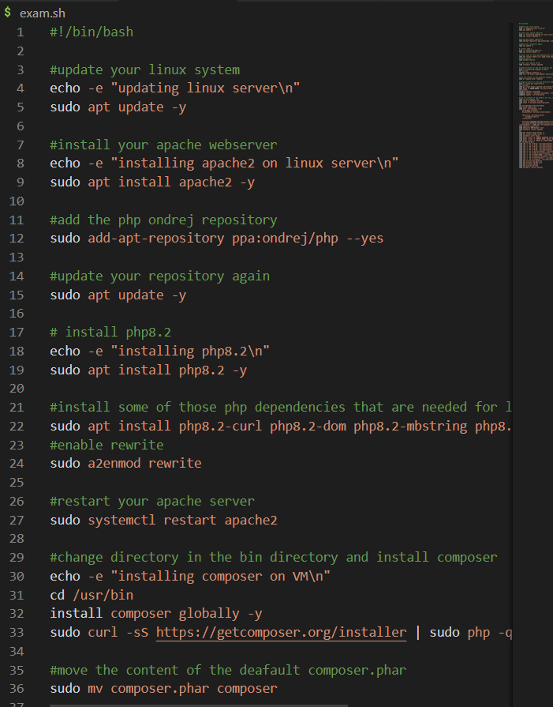
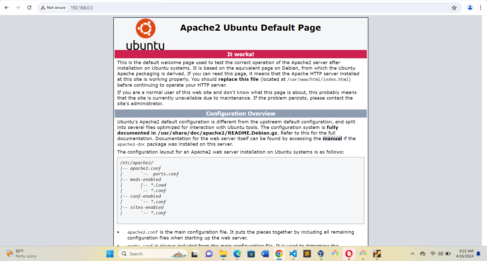
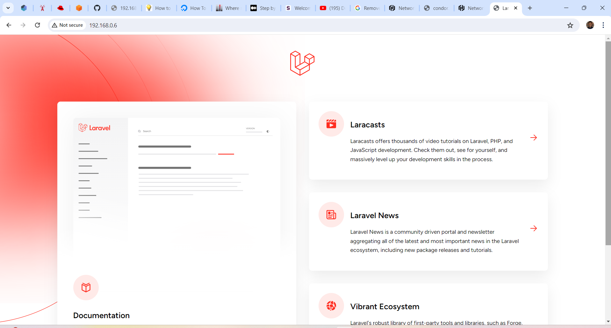
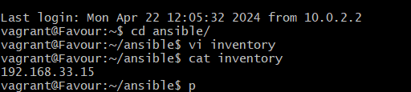
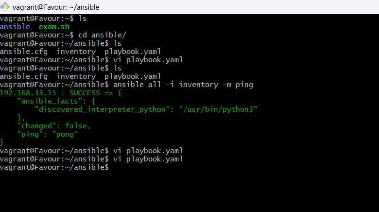
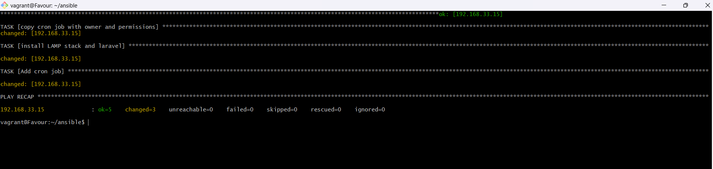
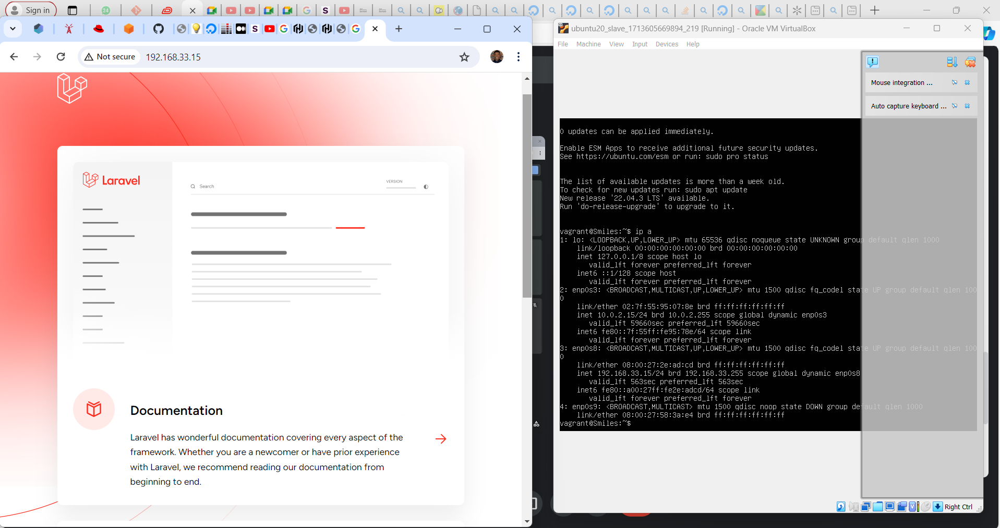

 1. provisioning of two Ubuntu-based servers, named “Master” and “Slave”, using Vagrant.
 

 2. creating a bash script to automate the deployment of a LAMP (Linux, Apache, MySQL, PHP) stack on the master node
   
 3. apache default page for the master node
   
 4.  laravel page after successful installation of LAMP and Laravel

 5. screenshot of the inventory file which contains the ip address of the slave node
  
 6. successfully ping to the slave node from the master
   
 7. successful ansible-playbook command

 8. successfully loading the slave ip address on a browser
   